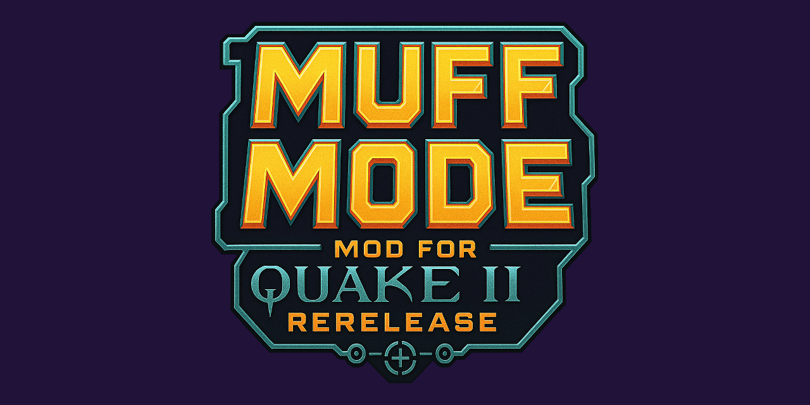

<table style="margin:0 auto; background:#5a2a8f; border-radius:16px; padding:24px 32px; border-collapse:separate; border-spacing:0; color:#f5e8ff; text-align:center;">
  <tr>
    <td style="text-align:center; border:none; vertical-align:middle; display:flex; flex-direction:column; align-items:center;">
      
      <h1 style="margin:16px 0 8px; font-size:36px; color:#f5e8ff;">Muff Mode BETA</h1>
      

        <strong>Muff Mode</strong> is a server-side mod for <a href="https://github.com/id-Software/quake2-rerelease-dll" target="_blank" style="color:#f8c2ff; text-decoration:underline;">QUAKE II Rerelease</a>
        providing an enhanced multiplayer experience.
      

    </td>
  </tr>
</table>

---

## Overview
- Purpose-built for multiplayer server hosts, level designers, and players who want modern conveniences.
- Bundles refined match handling, new game entities and gametypes, and quality-of-life tweaks.
- Ships with configuration, bot, and map overrides ready to go out of the box.

## Audience Snapshot
| Server Hosts | Level Designers | Players™ |
| --- | --- | --- |
| Refined match handling, warmups, countdowns, and flexible admin controls. | Expanded map entities/keys and added gametypes to design around. | Enhanced HUD info and configurable settings. |

## Installation
1. Locate your installation. For Steam, this is normally `C:\Program Files (x86)\Steam\steamapps\common\Quake 2\rerelease`.
2. Back up your `baseq2/game_x64.dll`.
3. Download the latest [Muff Mode release](https://github.com/themuffinator/muffmode/releases/latest).
4. Extract the entire zip to your `Quake 2` folder (not `rerelease`); allow file replacements (unless you already have Muff Mode, this should only replace the .dll).
5. Load the game up as normal. A range of configs can be executed to apply settings once a game has been set up.
6. Once a lobby has been set up, execute the included server config via `exec muff-sv.cfg`.

## What's in the Bag?
Muff Mode includes the game logic, a server config, bot files, and map entity overrides all straight out of the bag.

## Feature Overview
- **HUD & Scoreboard:** Frag messages (with position), dynamic miniscores with scorelimit, timers, match state, help texts, message of the day, mini scoreboard.
- **Game Menu:** Join matches, change or vote on settings, and view mod/server info.
- **Admin & Voting Controls:** Broad controls for admins plus improved voting workflows.
- **Match Handling:** Conditional progression with warmups, readying, countdowns, post-match delays, sudden death, overtime, and more.
- **Teamplay Enhancements:** Auto-balancing, forced balancing rules, improved team handling, team join communication, POIs for major items and weapon drops, friendly-fire warnings.
- **Map & Entity Control:** Extensive control over map item spawns and entity string overrides.
- **Spectating:** EyeCam spectating with smooth movement and aim prediction (mostly!).
- **Queues & Content:** MyMap map queuing inspired by tastyspleen.net and official **Muff Maps** leveraging enhanced capabilities.
- **Fixes & Tweaks:** Bug fixes, balance updates, and a variety of new server settings.

### Muff Maps
- **Almost Lost [Alpha v1] (mm-almostlost-a1):** Left out from Quake III: Arena's release, later finished and released as pro-q3tourney7. Streamlined for fast-paced FFAs and Duels.
- **Arena of Death [Alpha v3] (mm-arena-a3):** A small and simple gem from Quake III: Arena.
- **Hidden Fortress [Alpha v4] (mm-fortress-a4):** Small-to-medium-sized level connected via two teleporters. Originally created by Raster Productions for Quake III for Dreamcast, offering the revised layout found in Quake Live.
- **Longest Yard [Beta v2] (mm-longestyard-b2):** The quintessential space map from Quake III: Arena.
- **Proving Grounds [Alpha v4] (mm-proving-a4):** A small Duel map from Quake III: Arena.
- **Vertical Vengeance [Alpha v2] (mm-vengeance-a2):** A small Duel map from Quake III: Arena.

### New Gametypes
- **Horde:** Battle waves of monsters; stay on top of the scoreboard while defeating up to 16 waves to be victorious! Note: currently does not handle limited lives.
- **Duel:** Go head-to-head with an opponent; the victor faces the next opponent in the queue.
- **Clan Arena:** Rocket Arena's famous round-based team elimination mode—no item spawns, no self-damage, and a full arsenal of weapons.
- **CaptureStrike:** A Threewave classic combining Clan Arena, CTF, and Counter Strike. Teams alternate attacking/defending and battle until one team is dead or the attackers capture the flag.
- **Red Rover:** Clan Arena style where teams change on death. When a team is eliminated, the round ends.

### New Game Modifications
- **Vampiric Damage:** Gain health by inflicting damage. No health pickups; a draining health value keeps pressure high.
- **Nade Fest:** Grenade-only mode.
- **Weapons Frenzy:** Intensified combat with faster fire rates, faster rockets, regenerating ammo, and faster weapon switching.
- **Quad Hog:** Find the Quad Damage to become the Quad Hog!

### Deathmatch Refinements
- Intermission pre-delay: a one-second intermission pre-delay shows your final frag or capture before scores tally (no damage or additional scoring during this delay).
- Minimum respawn delay: a short delay helps avoid accidental respawns and creates a smoother transition.
- Kill beeps and frag messages highlight your frags and rank.

### Offhand Hook
- Added `hook` and `unhook` commands to use off-hand hook. Use `g_grapple_offhand 1` to enable.
- Players can use `alias +hook hook; alias -hook unhook; bind mouse2 +hook` to use it as a button command.

### Gameplay Tweaks and Fixes
- Instagib and Nade Fest now give players regeneration to recover from environmental damage, falling damage, etc.
- Quad and Protection player color shells no longer change depending on team, avoiding confusion.
- `func_rotating`: Rotating map entities now explode non-player entities such as dropped items (no more blocked rotator in dm5).
- Player Feedback: Added Fragging Spree award—broadcasted message "x is on a fragging spree with x frags" per every 10 frags achieved without dying or killing a team mate.
- Techs: fixed not being able to pick up your dropped tech.
- Blaster and Grapple are now droppable and can spawn in world.
- Current weapon is now droppable.
- Smart weapon auto-switch now moves to SSG from SG, CG from MG, and never auto-switches to chainfist.
- Instant gametype changing (e.g., from FFA to TDM).
- DuelFire Damage has been changed to Haste: 50% faster movement, 50% faster weapon rate of fire.
- Many more!

## Rulesets
Alter the gameplay balance by changing the ruleset.

### Quake II Rerelease (`g_ruleset 1`)
Everything remains as is.

### Muff Mode (`g_ruleset 2`)
This ruleset tackles several imbalances in the original game:
- **Plasma Beam** DM damage reduced from 15 to 10; maximum range limited to 768 units (same as LG in Q3).
- **Railgun:** restored to 150 damage in campaigns; rail knockback equals damage*2 (no difference in DM).
- **Slugs/Railgun:** reduced slug quantity from 10 to 5 to encourage dynamic gameplay.
- **Rockets:** removed randomized direct rocket damage (rand 100-120); now a consistent 120.
- **Invulnerability** powerup replaced by Protection—no splash damage, full protection from slime damage, one-third protection from lava, half direct damage after armor protection.
- **Adrenaline:** item now also increases max health by 5 during deathmatch.
- **Rebreather:** increased holding time from 30 to 45 seconds.
- **Auto Doc:** regen time increased from 500 ms to 1 sec; only regens either health or armor at a time.
- **Power Armor:** CTF's 1 damage per cell now applies across deathmatch (originally 2 damage per cell in all DM bar CTF)—same protection but roughly twice the cell consumption.
- Powerup spawn rules: 120 sec respawn default, 30–45 (randomized) initial spawn delay, global spawn and pickup sounds, spawn and pickup messages.

### Quake III Arena style (`g_ruleset 3`)
Inspired by Quake III Arena, this ruleset replicates key differences:
- Start with Machinegun and Rip Saw.
- Super Shotgun replaced by Shotgun.
- Weapon stats altered, including projectile velocity, spread, and damage.
- Ammo stats altered; ammo max is 200 for each type.
- Weapon pickup rule: +1 ammo if weapon is already held.
- Armor system: no tiers, +5 shard value, armor always provides 66% protection.
- Health and armor count down to max health.
- Spawning health bonus of 25.
- Removed Mega timer rule; Mega Health respawns after 60 seconds.
- **Invulnerability** powerup replaced by Protection—no splash damage, full protection from slime damage, one-third protection from lava, half direct damage after armor protection.
- Powerup spawn rules: 120 sec respawn default, 30–45 (randomized) initial spawn delay, global spawn and pickup sounds.

## Commands and Variables

### Admin Commands
Use **[command] [arg]** for the commands below:
- **startmatch**: force the match to start; requires warmup.
- **endmatch**: force the match to end; requires a match in progress.
- **resetmatch**: reset to warmup; requires a match in progress.
- **lockteam [red/blue]**: lock a team from being joined.
- **unlockteam [red/blue]**: unlock a locked team.
- **setteam [clientnum/name]**: force a team change for a client.
- **shuffle**: shuffle and balance teams, then reset the match (requires a team gametype).
- **balance**: balance teams without a shuffle; switches last-joined players from stacked team (requires a team gametype).
- **vote [yes/no]**: pass or fail a vote in progress.
- **spawn [entity_name] [spawn_args]**: spawn an entity (same as normal spawn server command) without requiring cheats.
- **map**: change the level to a specified map; map must be in the map list.
- **nextmap**: force level change to the next map.
- **map_restart**: restart current level and session; applies latched cvar changes.
- **gametype [gametype_name]**: change gametype, then reset the level.
- **ruleset <q2re|mm|q3a>**: change gameplay style.
- **readyall**: force all players to ready status (during readying warmup status).
- **unreadyall**: force all players to NOT ready status (during readying warmup status).

### Client Commands – Player Configuration
Use **[command] [arg]**:
- **announcer**: toggle support of QL match announcer events (uses vo_evil set, needs converting to 22KHz PCM WAV).
- **fm**: toggle frag messages.
- **help**: toggle help text drawing.
- **id**: toggle crosshair ID drawing.
- **kb**: toggle kill beeps.
- **timer**: toggle match timer drawing.

### Client Commands – Gameplay
- **hook/unhook**: hook/unhook off-hand grapple.
- **followkiller**: auto-follow killers when spectating (disabled by default).
- **followleader**: when spectating, auto-follow leading player.
- **followpowerup**: auto-follow player picking up powerups when spectating (disabled by default).
- **forfeit**: forfeits a match (currently only in duels, requires `g_allow_forfeit 1`).
- **ready/notready**: set ready status.
- **readyup**: toggle ready status.
- **callvote/cv**: call a vote (use vote commands).
- **vote [yes/no]**: vote or veto a callvote.
- **maplist**: show server map list.
- **motd""**: print the message of the day.
- **mymap**: add a map to the queue (must be a valid map from map list).
- **team [arg]**: select a team. Args:
  - **blue/b**: select blue team
  - **red/r**: select red team
  - **auto/a**: auto-select team
  - **free/f**: join free team (non-team games)
  - **spectator/s**: spectate
- **time-in**: cut a time out short.
- **time-out**: call a time out; only 1 allowed per player and lasts for value set by `g_dm_timeout_length` (in seconds). `g_dm_timeout_length 0` disables time outs.
- **follow [clientname/clientnum]**: follow a specific player.

### Vote Commands
Use **callvote [command] [arg]**:
- **map**: change the level to the specified map; map must be in the map list.
- **nextmap**: force level change to the next map.
- **restart**: force the match to reset to warmup; requires a match in progress.
- **gametype**: change gametype to the specified type (ffa|duel|tdm|ctf|ca|ft|rr|strike|lms|horde).
- **timelimit**: change timelimit to the minutes specified.
- **scorelimit**: change scorelimit to the value specified.
- **shuffle**: shuffle and balance the teams, then reset the match (requires a team gametype).
- **balance**: balance the teams without a shuffle; switches last-joined players from stacked team (requires a team gametype).
- **unlagged**: enable or disable lag compensation.
- **cointoss**: randomly returns either HEADS or TAILS.
- **random**: randomly returns a number from 2 to argument value, 100 max.
- **ruleset <q2re|mm|q3a>**: change gameplay style.
